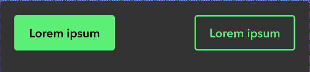

- [Task1 and Task 2 Sandbox Clone](https://codesandbox.io/p/sandbox/github/devpatelwebdeveloper/frontend-deviii-html-css)
- [Task3,3A and Task 4 Sandbox Clone](https://codesandbox.io/p/sandbox/github/devpatelwebdeveloper/frontend-deviii-react)

## Task1: Override using CSS

- Without touching the `styles.css`. Add a code in `<style></style>` and Reorder the the content in `price-box`
- DONOT Modify any other HTML code.


## Task 2: Two Sum Algorithm

Given an array of integers `nums` and an integer `target`, write a function that returns the two numbers such that they add up to the target.

```
Example:
Input: nums = [7,5,3,8,10,1,9], target = 6
Output: [1,5] or [5,1]

Input: nums = [1, 2, 3, 4, 5, 6, 7, 8], target = 15
Output: [7, 8] or [8, 7]

Input: nums = [10, 20, 30, 40, 50, 60, 70], target = 110
Output: [50, 60] or [60, 50]

Input: nums = [5, 12, 9, 21, 33, 4, 8, 15], target = 20
Output: [12, 8] or [8, 12]

Input: nums = [100, 4, 15, 22, 6, 9, 3, 200], target = 300
Output: [100, 200] or [200, 100]

Input: nums = [2, 3, 5, 7, 11, 13, 17, 19], target = 30
Output: [13, 17] or [17, 13]
```

## Task 3: Build an Image Carousel Component

- Create a functional image carousel component.
- You may use the following image URLs for data:

```
const imageUrls = [
"https://images.pexels.com/photos/269255/pexels-photo-269255.jpeg",
"https://images.pexels.com/photos/355235/pexels-photo-355235.jpeg",
"https://images.pexels.com/photos/416179/pexels-photo-416179.jpeg"
]
```

**Reference Material:**

[react-image-carousel-solution.webm](https://github.com/user-attachments/assets/825c9df4-c4ff-4bba-aacc-b721879fed18)

## Task 3A: CSS Variables & Component Design

Create a Button component that matches the design in the image below.

- **Requirement:** You must define and use semantic CSS Variables (Custom Properties) for your color palette.



# Bonus

## Task 4 - Responsive Card Component

Build a Card component based on the design provided.

[Figma Design](https://www.figma.com/board/YmNtQbluH9qyKrKEgBW12n/Tiles-Example?node-id=0-1&t=lZvhMIyz8dtqNo5a-1)

**Requirements:**

- Responsiveness: On viewports smaller than 500px, the cards must stack vertically.
- Interaction: Add a hover animation of your choice to the tiles.

### Reference: Color Palette

```
Hex:
Green:      #5BEF76
Blue:       #0D333F
Light Blue: #EAF6F7
White:      #FFFFFF
Black:      #000000
```
